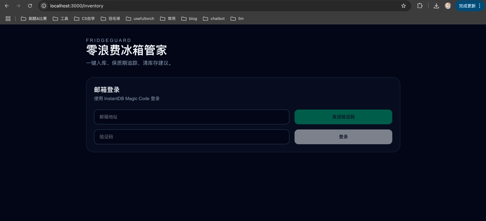
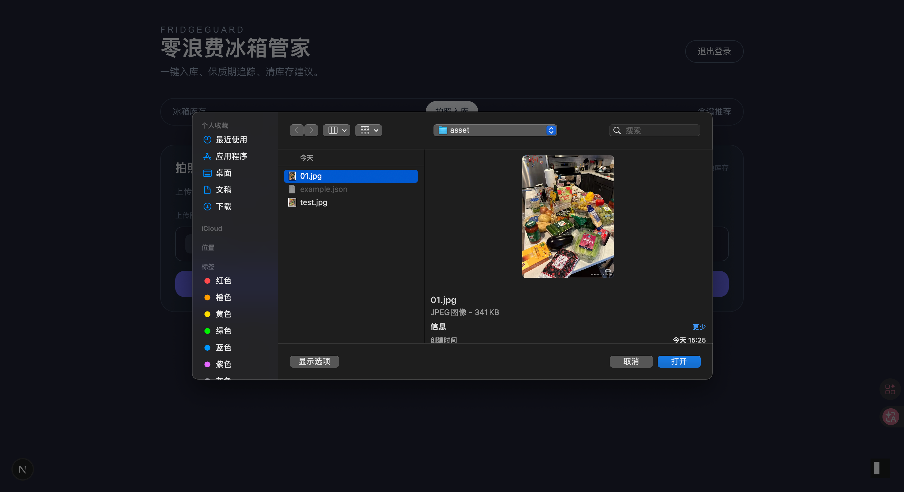
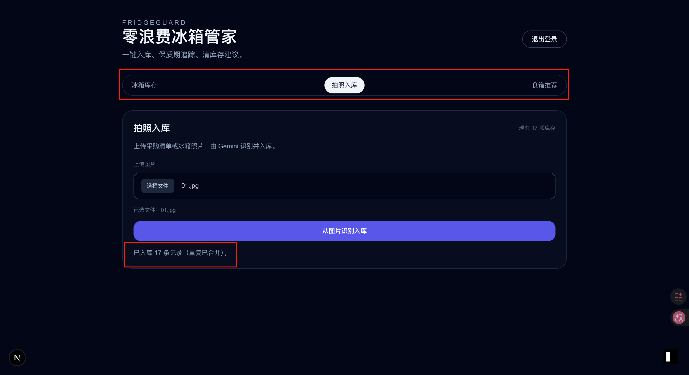
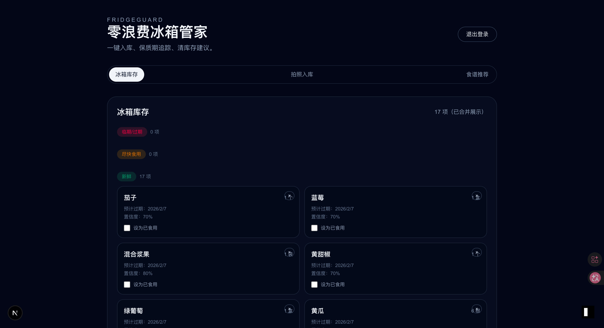
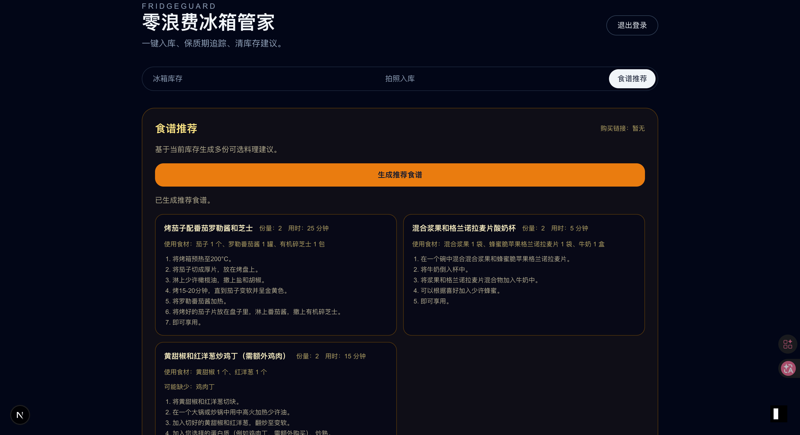

# FridgeGuard 部署说明

FridgeGuard 是一个基于 Next.js 的冰箱库存与食谱应用，使用 InstantDB 作为数据层，并通过 Gemini 进行 AI 识别与推荐。

## 功能展示

以下截图基于 `asset/` 中的图片（请确保图片位于仓库根目录的 `asset/` 下）：

- 登录界面：`asset/登陆.png`

- 上传冰箱图片：`asset/上传图片.png`

- 入库成功提示：`asset/入库成功.png`

- 冰箱库存视图：`asset/冰箱库存视图.png`

- 生成食谱推荐：`asset/生成食谱推荐.png`


## 测试用例图片

`asset/01.jpg` 与 `asset/test.jpg` 为上传冰箱图片的测试用例。

## 环境要求

- Node.js 20+（推荐）
- npm 10+（仓库使用 npm 管理）

## 环境变量

在本地或部署平台设置以下环境变量：

```
NEXT_PUBLIC_INSTANT_APP_ID=your_instant_app_id
GEMINI_API_KEY=your_gemini_api_key
GEMINI_MODEL=gemini-2.5-flash-lite
```

`GEMINI_MODEL` 可选，不配置时默认使用 `gemini-2.5-flash-lite`。

## 本地开发

```
npm install
npm run dev
```

如果需要同步 InstantDB schema：

```
npx instant-cli push
npx instant-cli pull
```

## 部署到 Vercel（推荐）

1. 将代码推送到 GitHub。
2. 在 Vercel 新建项目并导入仓库。
3. 设置 Root Directory 为 `fridgeguard/`。
4. 在 Vercel 项目设置中配置上面的环境变量。
5. 构建命令保持默认（`npm run build`），输出目录保持默认（`.next`）。
6. 点击 Deploy 即可。

## 其他平台部署

如果使用自建服务器或其他平台：

```
npm install
npm run build
npm run start
```

确保运行环境中已配置所需的环境变量。
